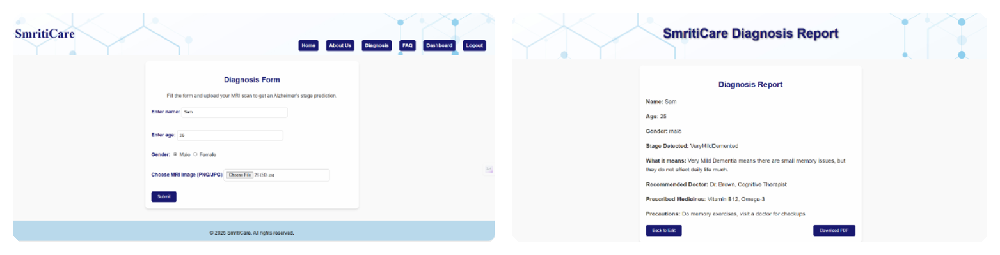
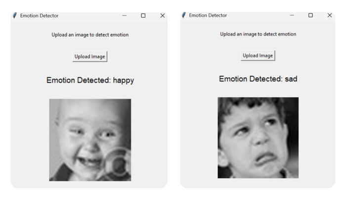
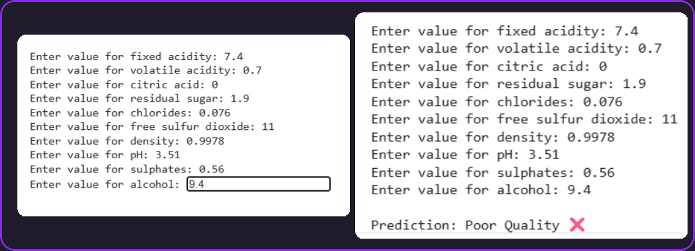

  

# Lisha Talele

### Artificial Intelligence & Data Science Student · India

 

 

## About

Final-year AI & Data Science student building applied ML and deep learning projects, with a focus on healthcare applications. Currently preparing to contribute to open source ahead of Google Summer of Code 2026. Shortlisted in SIH 2025 among 5,000+ teams nationwide.

 

## Tech Stack

 

## Projects

 

<table>
<tr>
<td width="45%">

</td>
<td width="55%" valign="middle">

### SmritiCare
Alzheimer's stage prediction from MRI scans using a CNN, wrapped in a Flask app with authentication and report generation.

`Python` `TensorFlow` `Flask` `SQLite`

[View live &nbsp;→]([https://smriticare-q3qk.onrender.com](https://smriticare-q3qk.onrender.com/signup))

</td>
</tr>
</table>

 

<table>
<tr>
<td width="55%" valign="middle">

### Emotion Detection
Real-time facial emotion recognition using computer vision and deep learning, classifying expressions from a live camera feed.

`Python` `OpenCV` `Deep Learning`

</td>
<td width="45%">

</td>
</tr>
</table>

 

<table>
<tr>
<td width="45%">

</td>
<td width="55%" valign="middle">

### Wine Quality Prediction
Compared Logistic Regression, SVM, and XGBoost models to classify wine quality from physicochemical properties.

`Python` `Scikit-learn` `XGBoost`

</td>
</tr>
</table>

 

## GitHub Stats

 

## Contact

 

If something here is useful to you, consider starring the repo.

